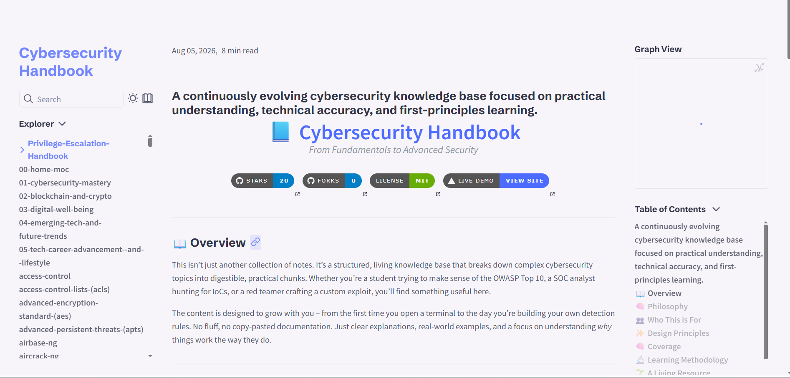
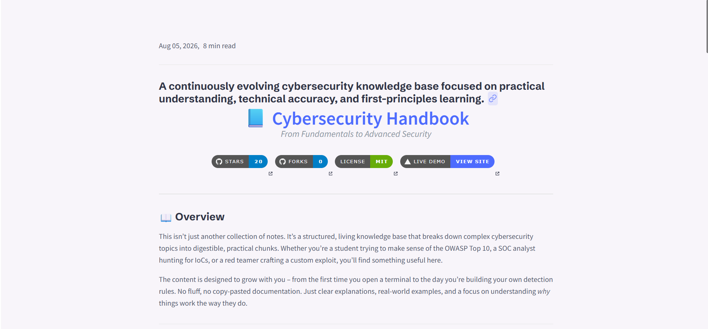
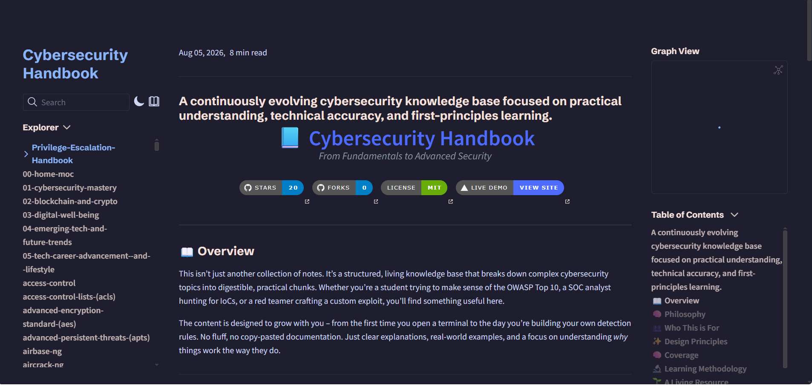
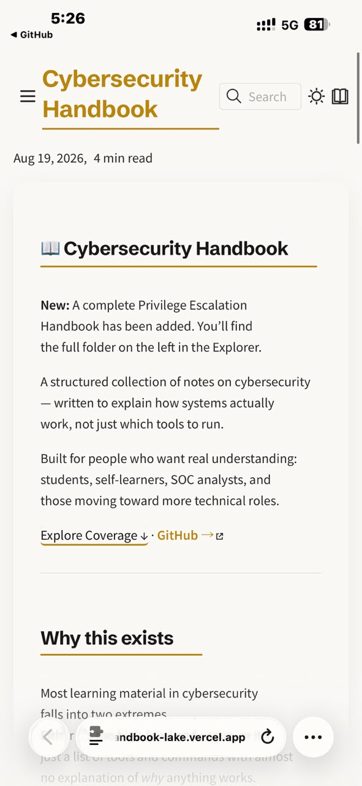

<h1 align="center">📚 Cybersecurity Handbook</h1>

<p align="center">
  A modern, open-source cybersecurity knowledge base designed to help students,
  professionals, and lifelong learners build practical security skills through
  structured notes, hands-on labs, and real-world concepts.
</p>

<p align="center">
  Built with <b>Quartz</b> • Powered by <b>Markdown</b> • Community Driven • MIT Licensed
</p>

<p align="center">
  <a href="https://cybersecurity-handbook-lake.vercel.app">
    
  </a>
  <a href="#getting-started">
    
  </a>
  <a href="#contributing">
    
  </a>
</p>

<p align="center">
  
  
  
  
  
  
  
  
</p>

---

> **Learn cybersecurity with clarity — from fundamentals to advanced concepts, all in one searchable, open-source handbook.**

<div align="center">

<table>
<tr>
<th>📚 Notes</th>
<th>🧪 Labs</th>
<th>🔍 Search</th>
<th>⚡ Performance</th>
<th>🤝 Community</th>
</tr>

<tr>
<td>Continuously Growing</td>
<td>Hands-on Learning</td>
<td>Lightning Fast</td>
<td>Powered by Quartz</td>
<td>Open Source</td>
</tr>
</table>

</div>

---

## Preview

## What It Looks Like

<p align="center">
  <picture>
    <source media="(max-width: 600px)" srcset="assets/images/Homepage.png" width="280">
    
  </picture>
  <picture>
    <source media="(max-width: 600px)" srcset="assets/images/graph-view.png" width="280">
    
  </picture>
  <picture>
    <source media="(max-width: 600px)" srcset="assets/images/reader-mode.png" width="280">
    
  </picture>
</p>

<p align="center">
  <strong>Clean Homepage</strong> &nbsp;&nbsp;|&nbsp;&nbsp;
  <strong>Interactive Graph</strong> &nbsp;&nbsp;|&nbsp;&nbsp;
  <strong>Reader Mode</strong>
</p>

---

### Homepage

<p align="center">
  
</p>

*The clean, distraction-free homepage — designed for reading.*

---

### Interactive Knowledge Graph

<p align="center">
  
</p>

*See how topics connect. Every note is linked to related concepts.*

---

### Reader Mode

<p align="center">
  
</p>

*Focus on what matters. No distractions, just learning.*

---

### Dark Mode (Catppuccin Mocha)

<p align="center">
  
</p>

*Easy on the eyes — perfect for late-night reading sessions.*

---

### Mobile View

<p align="center">
  
</p>

*Fully responsive — access from any device, anywhere.*

---

## Why I Built This

I've been in the same place you probably are right now — reading through forums, watching YouTube tutorials, trying to piece together what actually matters in cybersecurity.

Most resources I found were either:

- Too shallow — just a list of tools with no explanation of why they work.
- Too scattered — good content spread across 20 different blogs and paid courses.
- Too expensive — not everyone can afford a $500 course just to get started.

So I started writing my own notes. Notes that actually explain *how things work*, not just what commands to run. Over time, those notes grew into this handbook.

I'm not a guru. I don't have all the answers. But I do believe that **anyone can learn this stuff** if it's explained clearly and practically.

If this handbook saves you even one late-night Google rabbit hole, it was worth the effort.

**You're not alone in this. Let's learn together.**

---

## What This Handbook Offers

This is a free, open-source collection of cybersecurity notes.

It's built with Quartz — so you can search through everything instantly, see how topics connect visually, and navigate easily. The content covers real-world threats, tools, and defense strategies, and it's maintained by people who work in the field.

No ads. No paywalls. Just clear explanations of how things work.

---

## Key Features

There's a lot here — over 400 notes covering OSINT, cryptography, cloud security, and everything in between.

You can search through everything instantly. See how topics connect visually with the knowledge graph. Read in dark mode or light mode, on your phone or your laptop.

And everything is built around first-principles learning.

No fluff. No filler. Just the information you actually need.

---

## Quick Start

Get the handbook running locally in under 2 minutes.

### Prerequisites

- **Node.js** (v18 or later)
- **npm** or **yarn**

### Installation & Run

**Linux/macOS (bash/zsh)**

```bash
git clone https://github.com/priyanshu-rawa/Cybersecurity-Handbook.git
cd Cybersecurity-Handbook
npm install
npm run quartz:dev
```

#### **Windows (PowerShell)**

```powershell
# Clone the repository
git clone https://github.com/priyanshu-rawa/Cybersecurity-Handbook.git
cd Cybersecurity-Handbook

# Install dependencies
npm install

# Start the development server
npm run quartz:dev
```

### Build for Production

```bash
# Build static site
npm run quartz:build

# Preview the build locally
npm run quartz:serve
```

---


##  📖 What's Covered

**Operating Systems** – Linux, Windows, networking basics like TCP/IP, DNS, VPNs, and firewalls.

**Offensive Security** – OWASP Top 10, SQL injection, XSS, scanning, exploitation, and post‑exploitation.

**Defensive Security** – SOC, incident response, SIEM, log analysis, threat hunting, and digital forensics.

**Cloud & Infrastructure** – AWS, Azure, GCP, Zero Trust, Docker, Kubernetes, DevSecOps, and IAM.

**Programming & Automation** – Python, Bash, PowerShell, scripting, CI/CD, and Git.

**Cryptography** – Symmetric and asymmetric encryption, AES, RSA, hashing (SHA‑256, MD5), PKI, TLS, and certificates.

---

## Philosophy

Understanding the technology is the foundation of everything else.

This handbook explains operating systems, networking, protocols, memory, authentication, and processes – how they work and what they do. Every topic focuses on clear definitions and practical explanations.

Because if you understand what's happening under the hood, everything else follows.

---

## Contributing

I welcome contributions of all kinds — from fixing a typo to adding an entire new topic. First time contributing to open source? No worries — I'll guide you through it.

### Quick Steps

1. **Fork** the repository
2. **Create a branch**: `git checkout -b feature/your-feature-name`
3. **Make your changes** and commit: `git commit -m "Add: brief description"`
4. **Push to your fork**: `git push origin feature/your-feature-name`
5. **Open a Pull Request** against the `main` branch

### Ways to Help

- **Content** – Add new topics, fix errors, improve explanations
- **Design** – Improve visuals, add diagrams, enhance layout
- **Code** – Fix bugs, improve the Quartz setup, add features
- **Documentation** – Improve clarity, formatting, cross-references
- **Community** – Report issues, suggest improvements, help others

---

###  Quick Guide

| Step | Action |
|------|--------|
| 1 | **Fork** the repository — click the "Fork" button at the top right |
| 2 | **Clone** your fork locally: `git clone https://github.com/your-username/Cybersecurity-Handbook.git` |
| 3 | **Create a branch** for your changes: `git checkout -b feature/your-feature-name` |
| 4 | **Make your changes** — add notes, fix typos, update content |
| 5 | **Stage your changes**: `git add .` |
| 6 | **Commit with a clear message**: `git commit -m "Add: New section on ransomware defense"` |
| 7 | **Push to your fork**: `git push origin feature/your-feature-name` |
| 8 | **Open a Pull Request** — go to the original repo and click "Compare & pull request" |

---

###  Where to Put Files
Cybersecurity notes → content/ (in the relevant category folder)

Images → assets/images/

Diagrams → assets/diagrams/

Labs → content/ (in the relevant lab folder)


---

###  Support & Sponsorship

This handbook is — and will always be — **completely free and open source**.  
If it's helped you in any way, here are some simple ways to give back.

> *"Open source is built by people who care. Every contribution — no matter how small — makes a difference."*

##  How You Can Support

Star the repo – Adds a star to the project on GitHub. Increases visibility and discoverability.

Share the handbook – Post it on LinkedIn, Twitter, Reddit, Discord. Drives organic growth of the community.

Contribute content – Add new topics, fix typos, sharpen explanations. Makes the content better for everyone.

Give feedback – Open an issue or start a discussion. Guides future improvements and priorities.

Tell a friend – Share with someone learning cybersecurity. Expands the network of learners and practitioners.

Report bugs – Let me know if something is broken or unclear. Keeps the handbook accurate and reliable.

Use it daily – Reference it in your learning or work. The best support is using it.

---

###  Say Thanks

A simple "thank you" or "this helped me" goes a long way. If this handbook made a difference in your learning journey, I'd love to hear about it.

- 📧 **Email**: `zero.trace0654@proton.me`

---

### Spread the Word

The best way to support this project is to share it with others who might find it useful.

Copy this and share it:

> *"I found this free Cybersecurity Handbook with 400+ notes, built with Obsidian + Quartz. Check it out: https://github.com/priyanshu-rawa/Cybersecurity-Handbook"*

---

### Join the Community

- **Star on GitHub**: https://github.com/priyanshu-rawa/Cybersecurity-Handbook
- **Visit the live site**: https://cybersecurity-handbook-lake.vercel.app
- **Start a discussion**: Open an issue or start a conversation

---

Thank you for being part of this journey. Every star, share, and contribution matters.

[](https://github.com/priyanshu-rawa/Cybersecurity-Handbook)
[](https://github.com/priyanshu-rawa/Cybersecurity-Handbook)


---

##  License

This project is licensed under the **MIT License** — see the [LICENSE](LICENSE) file for details.

You are free to use, modify, distribute, and even commercialize this work, as long as you retain the copyright notice. We encourage you to contribute back improvements!

---

## Star, Fork, Share

If you find this handbook useful:

- **Star** the repository to show your appreciation and increase visibility.
- **Fork** it to customize or contribute back.
- **Share** it with your network — on Twitter, LinkedIn, or any cybersecurity community.

Every star, fork, and share helps someone discover this resource.

---

<div align="center">

**Cybersecurity Handbook**

*A continuously evolving knowledge base built through documentation, experimentation, and practical learning.*

Always Learning · Always Documenting · Always Improving

</div>

If this helped you, drop a star — it keeps me motivated to build more.
