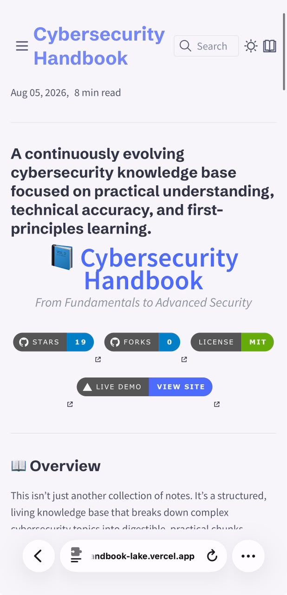

<h1 align="center">Cybersecurity Handbook</h1>

<p align="center">
  My personal cybersecurity knowledge base — notes, labs, and cheat sheets I've
  been putting together while learning this stuff properly, from the ground up.
</p>

<p align="center">
  Built with <b>Quartz</b> • Written in <b>Markdown</b> • MIT Licensed
</p>

<p align="center">
  <a href="https://cybersecurity-handbook-lake.vercel.app">
    
  </a>
  <a href="#quick-start">
    
  </a>
  <a href="#contributing">
    
  </a>
</p>

<p align="center">
  
  
  
  
  
  
  
  
</p>

---

> Most cybersecurity learning material falls into two extremes — either too high-level and vague, or just a pile of tools and commands with no explanation of why any of it works. This is my attempt at something in between.

---

## Preview

<p align="center">
  <picture>
    <source media="(max-width: 600px)" srcset="assets/images/Homepage.png" width="280">
    
  </picture>
  <picture>
    <source media="(max-width: 600px)" srcset="assets/images/graph-view.png" width="280">
    
  </picture>
  <picture>
    <source media="(max-width: 600px)" srcset="assets/images/reader-mode.png" width="280">
    
  </picture>
</p>

<p align="center">
  <strong>Homepage</strong> &nbsp;&nbsp;|&nbsp;&nbsp;
  <strong>Knowledge Graph</strong> &nbsp;&nbsp;|&nbsp;&nbsp;
  <strong>Reader Mode</strong>
</p>

---

### Homepage

<p align="center">
  
</p>

Kept it clean on purpose — no clutter, just the content.

---

### Interactive Knowledge Graph

<p align="center">
  
</p>

Every note links to related topics, so you can see how things connect instead of reading in isolation.

---

### Reader Mode

<p align="center">
  
</p>

Strips away the noise when you just want to read.

---

### Dark Mode (Catppuccin Mocha)

<p align="center">
  
</p>

For the late-night study sessions. You know the ones.

---

### Mobile View

<p align="center">
  
</p>

Works fine on a phone if you're reading on the go.

---

## Why I Built This

Most learning material in cybersecurity falls into two extremes. Either it's too high-level and vague, or it's basically a list of tools and commands with almost no explanation of why any of it works. I wanted something in between.

This handbook is my attempt to document things properly — starting from first principles, then moving into practical use, attack techniques, and defensive approaches. It's free, it's open, and there's no ad or paywall between you and the notes.

I'm building this for anyone who wants a real understanding of the subject: students, self-learners, SOC analysts, or anyone moving toward a more technical security role.

---

## What's in It

- **400+ notes** covering everything from OSINT to cryptography to cloud security
- An **interactive knowledge graph** so you can see how topics connect
- **Full-text search** across the whole handbook
- **Dark/light mode**, including a Catppuccin Mocha theme if you're into that
- Fully **mobile-friendly**
- Written with a **first-principles** approach — the *why*, not just the *how*

---

## Quick Start

Should take you a couple of minutes to get running locally.

**Requirements:** Node.js v18+ and npm (or yarn).

### Linux / macOS

```bash
git clone https://github.com/priyanshu-rawa/Cybersecurity-Handbook.git
cd Cybersecurity-Handbook

npm install
npm run quartz:dev
```

### Windows (PowerShell)

```powershell
git clone https://github.com/priyanshu-rawa/Cybersecurity-Handbook.git
cd Cybersecurity-Handbook

npm install
npm run quartz:dev
```

### Building for production

```bash
npm run quartz:build
npm run quartz:serve
```

---

## What's Inside

### Operating Systems

| Category | Topics |
|----------|--------|
| Linux | Internals, commands, hardening |
| Windows | Internals, Active Directory, security |
| Networking | TCP/IP, DNS, HTTP/HTTPS, VPNs, firewalls |

### Offensive Security

| Category | Topics |
|----------|--------|
| Web Security | OWASP Top 10, SQL injection, XSS |
| Vulnerability Assessment | Scanning, enumeration, exploitation |
| Penetration Testing | Methodology, tooling, reporting |
| Post-Exploitation | Persistence, lateral movement, privilege escalation |

### Defensive Security

| Category | Topics |
|----------|--------|
| SOC | Monitoring, incident response |
| Detection Engineering | SIEM, log analysis, threat hunting |
| Digital Forensics | Memory forensics, network forensics, malware analysis |

### Cloud & Infrastructure

| Category | Topics |
|----------|--------|
| Cloud Security | AWS, Azure, GCP, Zero Trust |
| Container Security | Docker, Kubernetes, DevSecOps |
| IAM | Identity management, federation, MFA |

### Programming & Automation

| Category | Topics |
|----------|--------|
| Languages | Python, Bash, PowerShell |
| Automation | Scripting, CI/CD, Git |

### Cryptography

| Category | Topics |
|----------|--------|
| Encryption | Symmetric, asymmetric, AES, RSA |
| Hashing | SHA-256, MD5, hash functions |
| PKI | Digital signatures, TLS, certificates |

---

## Philosophy

Cybersecurity is fundamentally about understanding systems. Without a real grasp of operating systems, networking, protocols, authentication, memory, processes, and how applications are put together, tools end up being little more than buttons you press without knowing why.

That's the whole idea behind this handbook: understand the technology before you try to secure or exploit it. Every topic tries to answer not just *what* something does, but *how* it works internally and *why* it behaves that way.

---

## Roadmap

Things I'm planning to add or expand:

- [ ] Deeper Linux internals documentation
- [ ] Windows internals series
- [ ] Networking deep dives
- [ ] Active Directory attack and defense labs
- [ ] SOC investigation playbooks
- [ ] Detection engineering content
- [ ] Malware analysis workflows
- [ ] Reverse engineering notes
- [ ] Cloud security documentation
- [ ] More diagrams and architecture illustrations
- [ ] Hands-on lab environments

---

## Contributing

Contributions are welcome — fixing a typo, adding a topic, improving an explanation, whatever. All of it helps.

If this is your first time contributing to open source, don't stress about it, I'll help you through it if you get stuck (open an issue or discussion).

**Ways to help:**

- Content — new topics, corrections, better explanations, real-world examples
- Design — diagrams, layout tweaks, visual improvements
- Code — bug fixes, Quartz config improvements, new features
- Docs — clarity, formatting, cross-references
- Community — reporting issues, answering questions, spreading the word

**Steps:**

1. Fork the repo
2. Clone your fork: `git clone https://github.com/your-username/Cybersecurity-Handbook.git`
3. Create a branch: `git checkout -b feature/your-feature-name`
4. Make your changes
5. Commit: `git commit -m "Add: section on ransomware defense"`
6. Push: `git push origin feature/your-feature-name`
7. Open a pull request against `main`

**A few guidelines:**

Write clearly, and back things up with practical examples where you can. Use proper Markdown headings and tag code blocks with a language (` ```bash `, ` ```python `, etc). Images go in `assets/images/` with descriptive lowercase filenames. If you're not sure where something should live, open an issue first and we'll figure it out together.

**File locations:**

| File Type | Location |
|-----------|----------|
| Notes | `content/` (relevant category folder) |
| Images | `assets/images/` |
| Diagrams | `assets/diagrams/` |
| Labs | `content/` (relevant lab folder) |

See [CONTRIBUTING.md](CONTRIBUTING.md) and the [Code of Conduct](CODE_OF_CONDUCT.md) for more detail.

---

## Support

This project is free and stays free. If it's been useful to you, here's what actually helps:

- **Star the repo** — makes it easier for other people to find
- **Share it** — LinkedIn, Twitter, Reddit, Discord, wherever your people are
- **Contribute** — even a small fix counts
- **Give feedback** — open an issue or a discussion, tell me what's missing or wrong
- **Report bugs** — if something's broken, I want to know
- **Just use it** — reference it while you're learning or working, that's the whole point of it existing

If it helped you or you just want to say something, I'm at `zero.trace0654@proton.me`.

Want to share it? Feel free to just send people this:

> "Found this free Cybersecurity Handbook — 400+ notes, built with Obsidian + Quartz: https://github.com/priyanshu-rawa/Cybersecurity-Handbook"

---

## License

MIT licensed — see [LICENSE](LICENSE). Use it, modify it, fork it, build on it. If you improve something, sending it back helps everyone else too.

---

<div align="center">

**Cybersecurity Handbook**

A knowledge base that keeps growing as I keep learning and documenting.

If this helped you, a star goes a long way — it's genuinely motivating.

</div>
