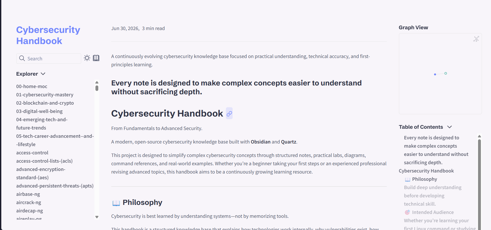
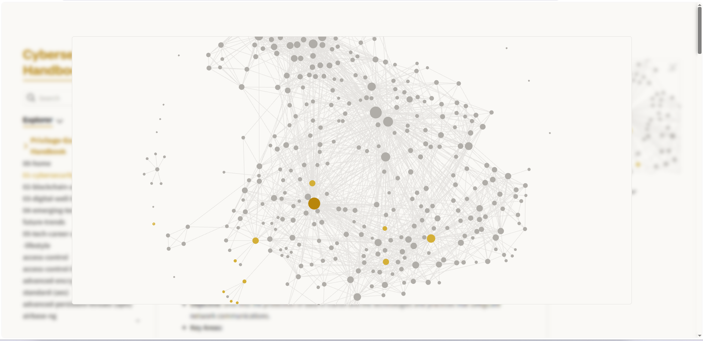
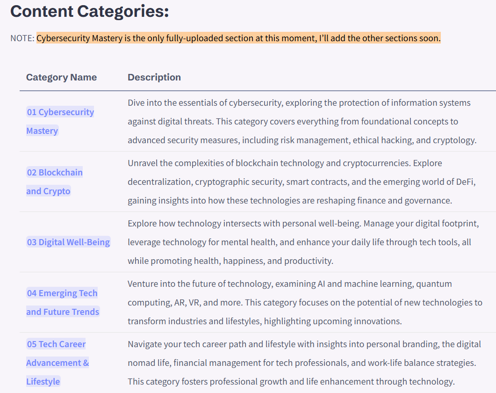
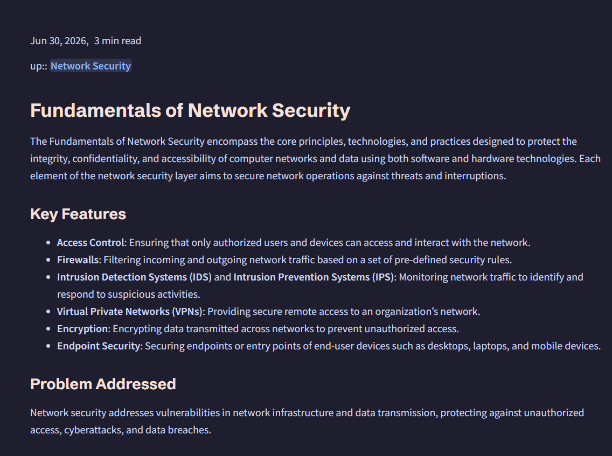

# Cybersecurity Handbook
[](LICENSE)

[](https://github.com/priyanshu-rawa/Cybersecurity-Handbook/stargazers)

[](https://github.com/priyanshu-rawa/Cybersecurity-Handbook/network)

[](https://github.com/priyanshu-rawa/Cybersecurity-Handbook/issues)

An open-source cybersecurity knowledge base focused on understanding systems from first principles.
This is my first open-source cybersecurity project on GitHub and a long-term effort to document everything I learn while studying cybersecurity.

Instead of collecting random notes, my goal is to build a structured knowledge base that explains concepts from first principles through practical examples, diagrams, hands-on labs, and real-world scenarios.

Cybersecurity Handbook is a long-term documentation project that consolidates practical cybersecurity knowledge into a structured, searchable reference. It combines conceptual explanations, hands-on notes, command references, diagrams, and lab documentation across multiple cybersecurity domains.

---

## Preview

<p align="center">
  
  
</p>

<p align="center">
  
  
</p>

---

### 🕸️ Interactive Knowledge Graph


---
### 📚 Categories


---
### 📖 Reader Mode


---

## Highlights

- 📚 400+ Cybersecurity Notes
- 🌐 Interactive Knowledge Graph
- 🔍 Full-text Search
- 🧠 First-Principles Learning
- 📖 Built with Obsidian + Quartz
- 🚀 Continuously Updated

---

# Philosophy

Cybersecurity is fundamentally built on understanding systems.

Without a solid grasp of operating systems, networking, protocols, authentication, memory, processes, and application architecture, tools become little more than buttons to press.

This handbook is built around one principle:

> **Understand the technology before learning how to secure or exploit it.**

Each topic aims to answer not only *what* something does, but also *how* it works internally and *why* it behaves that way.

---

# What You'll Find

The handbook combines theory with practical learning through:

- First-principles explanations
- Architecture and workflow diagrams
- Practical command references
- Hands-on laboratory notes
- Security concepts explained from the ground up
- Real-world examples and attack scenarios
- Defensive techniques and mitigation strategies
- Cross-referenced documentation for related topics

Every section is designed to remain useful as both a learning resource and a long-term technical reference.

---

# Coverage

Current and planned topics include:

### Operating Systems

- Linux
- Windows
- Active Directory
- Windows Internals
- Linux Internals

### Networking

- TCP/IP
- Routing & Switching
- DNS
- HTTP/HTTPS
- VPN
- Firewalls
- Network Architecture

### Offensive Security

- Web Security
- Vulnerability Assessment
- Penetration Testing
- Privilege Escalation
- Enumeration
- Exploitation
- Post Exploitation

### Defensive Security

- Security Operations (SOC)
- Threat Detection
- Incident Response
- Detection Engineering
- Log Analysis
- SIEM
- Digital Forensics

### Malware & Reverse Engineering

- Malware Analysis
- Static Analysis
- Dynamic Analysis
- Reverse Engineering
- Windows APIs

### Cloud & Infrastructure

- Docker
- Kubernetes
- Cloud Security
- Identity & Access Management
- Zero Trust

### Programming & Automation

- Python
- Bash
- PowerShell
- Git
- Automation Scripts

### Cryptography

- Symmetric Encryption
- Asymmetric Encryption
- Hash Functions
- PKI
- Digital Signatures
- TLS

---

# Project Goals

This repository is intended to become a comprehensive cybersecurity reference that emphasizes:

- Technical accuracy
- Clear explanations
- Practical applicability
- Long-term maintainability
- Consistent documentation
- Beginner accessibility without sacrificing technical depth

The objective is not simply to document tools, but to build an interconnected knowledge base that explains the reasoning behind modern cybersecurity practices.

---

# Technology Stack

- **Obsidian** — Knowledge management
- **Quartz v5** — Static site generator
- **TypeScript**
- **SCSS**
- **GitHub Pages**

---

# Repository Structure

```text
content/
├── Linux
├── Windows
├── Networking
├── Cryptography
├── Active Directory
├── Web Security
├── Malware Analysis
├── Reverse Engineering
├── Cloud Security
└── ...

quartz/
quartz.config.yaml
public/
```

---

# Roadmap

Planned improvements include:

- Expanded Linux internals documentation
- Windows internals series
- Networking deep dives
- Active Directory attack and defense labs
- SOC investigation playbooks
- Detection engineering content
- Malware analysis workflows
- Reverse engineering notes
- Cloud security documentation
- Interactive diagrams
- Architecture illustrations
- Practical lab environments

---

# Contributing

Constructive feedback, corrections, and suggestions are always appreciated.

If you identify inaccurate information, discover outdated content, or have ideas that improve the quality of the documentation, feel free to open an Issue or submit a Pull Request.

---

# License

Released under the MIT License.

---

<div align="center">

**Cybersecurity Handbook**

*A continuously evolving cybersecurity knowledge base built through documentation, experimentation, and practical learning.*

**Always Learning · Always Documenting · Always Improving**

</div>
